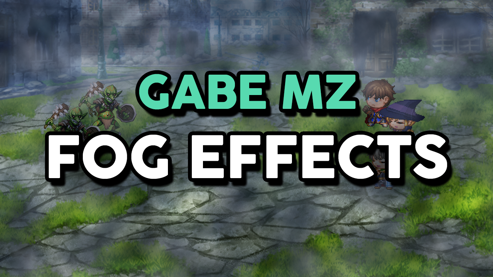

# Gabe MZ - Fog Effects

```
03/09/20 | Version: 2.0.1 | Scene return bug fix
02/09/20 | Version: 2.0.0 | Completely rewritten code
28/09/20 | Version> 1.1.0 | Redone fog effects layer system
26/08/20 | Version: 1.0.3 | Cleaned code and help section improved
25/08/20 | Version: 1.0.0 | Released
```

***

This plugin provides a option to create and display fog effects on maps and battles.

***

## Download
### [Gabe MZ - Fog Effects](https://dromarch.itch.io/gabe-mz-fog-effects) (v2.0.1)

***

## How to use?

The first step are setup the Plugin Parameters.

***

### The Plugin Parameters:


- **Fog Settings** - This parameter is a list where all the fog effects that will be used in the game must be configured.

- **Fog in Map?** - This parameter defines whether the fog effects will be visible on the maps by default.

- **Fog in Battle?** - This parameter defines whether the fog effects will be visible on the battles by default.

***

### The Fog Settings Parameter:

This is the Fog Settings parameter interface:


- **Red Area** - The values in this area indicate the **ID** of each configured fog effect.

- **Green Area** - Each line in this area corresponds to a configured fog effect.

Click on a empty line to create a new effect. When you do this a new window with settings options will open.


Now just configure a new fog effect as you wish.

- **Fog Filename** - The fog effect image filename. This image **needs** to be in the *img/fogs* folder. If this folder does not exist in your project, you must create it.

- **Fog Opacity** - The fog effect opacity. It can be any value between 0 (transparent) and 255 (opaque).

- **Fog Blend Mode** - The fog effect blending mode. It can be *Normal*, *Addition* or *Subtract*. If you don't know what is this, read [this article](https://en.wikipedia.org/wiki/Blend_modes).

- **Fog Move X** - The fog effect horizontal movement constant. When *0* the fog *don't move* horizontally. When it's *negative* it *moves to the left* and when it's *positive* to the *right*.

- **Fog Move Y** - The fog effect vertical movement constant. When *0* the fog *don't move* vertically. When it's *negative* it *moves upwards* and when it's *positive* *downwards*.

***

### Adding a Fog Effect to the map:

After that, you can add the fog effects you're created to the map using a specific **Note Tag** in the **Map Notes** or using the provided **Plugin Commands**.

When adding a fog effects through the **Map Notes**, it will be *perpetually linked to that map*. You can, through the Plugin Commands, temporarily erase all fog effects from the map, but *when moving from one map to the other the effect will be returned*.

Adding a fog effects through the **Plugin Commands** makes it *temporary*, *when the player moves between maps it will be discarded*.

There are circumstances for each case, choose the one that best suits you for use. Both modes can also be combined and used simultaneously.

***

### The Fog Effects Layers:

The fog effects are added to the map through a layer system. Whenever you add a new fog effect you will need to define a layer for it. The higher the layer id, the higher the priority of the fog effect over the others. If you define a fog effect to take over an already occupied layer, the previous effect will be deleted so that the new one takes its place.

***

### The Map Note Tag:


```
<addFog layer: id>      // This tag links the defined fog effect to the defined layer on the map.
                        //    layer: The layer id
                        //    id: The fog effect id
```
#### Usage Examples:
```
<addFog 0: 1>           // This tag adds the fog effects of ID 1 at layer 0.

<addFog 4: 3>           // This tag adds the fog effects of ID 3 at layer 4.

<addFog 2: 7>           // This tag adds the fog effects of ID 7 at layer 2.
```

***

### The Plugin Commands:


- **Set Fog Effect** - This command allows to set a specific fog effect to a specific layer.

- **Remove Fog Effect from Layer** - This command allows to remove the fog effect from the specific layer. 

- **Clear Screen** - This command clear all screen, removing all fog effects from all layers.

- **Set Fog in Map** - This command allows to set whether the fog effects will be displayed in the game maps.

- **Set Fog in Battle** - This command allows to set whether the fog effects will be displayed during battles.

***

These are all existing settings and options. Just remember that the fog images must be in the folder **img/fogs/**.

If you have any questions, have found a bug or want to make a suggestion, join our Discord server: [Comuns Plugins](https://discord.gg/GG85QRz).