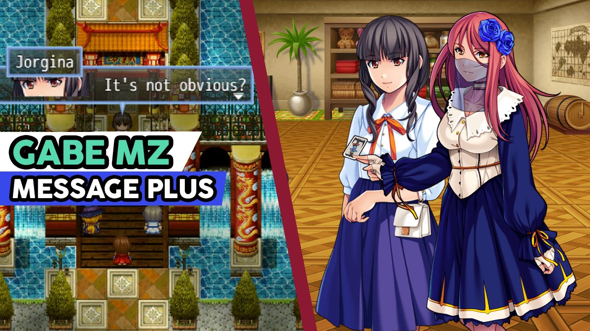

# Gabe MZ - Message Plus

```
26/09/20 | Version: 1.0.0 | Released
```

***

This plugin adds significant improvements to the default RPG Maker message system.

***

## Plugin Commands:
Below is a list of the plugin commands that can be used:

### Window Settings (Easy):

Easy configuration mode, to set the parameters of the Message Window quickly and efficiently.

```
Window Horizontal Pos       // Changes the horizontal position of the Message Window.
Window Vertical Pos         // Changes the vertical position of the Message Window.
Window Width                // Changes the width of the Message Window.
Window Height               // Changes the height of the Message Window.
Window Padding              // Changes the padding of the Message Window.
```

### Window Settings (Hard):

Advanced configuration mode, allows full control of the Message Window, but requires a certain level of knowledge.

```
Window X Pos                // Changes the X position of the Message Window.
Window Y Pos                // Changes the Y position of the Message Window.
Window Width                // Changes the width of the Message Window.
Window Height               // Changes the height of the Message Window.
Window Padding              // Changes the padding of the Message Window.
```

### Pause Sign Settings:

Configure the Message Window Pause Sign settings.

```
Pause Sign X Pos            // Changes the X position of the Pause Sign.
Pause Sign Y Pos            // Changes the Y position of the Pause Sign.
Pause Sign Visibility       // Changes the visibility of the Pause Sign.
```

### Name Box Settings:

Configure the Name Box window settings.

```
Name Box X Offset           // Changes the X offset of the Name Box window.
Name Box Y Offset           // Changes the Y offset of the Name Box window.
Name Box Padding            // Changes the padding of the Name Box window.
```

### Choice List Settings:

Configure the Choice List window settings.

```
Choice List X Offset        // Changes the X offset of the Choice List window.
Choice List Y Offset        // Changes the Y offset of the Choice List window.
Choice List Padding         // Changes the padding of the Choice List window.
```

### Reset Message Window Settings:

Reset all Message Window settings to their default settings.

### Reset Pause Sign Settings:

Reset all Pause Sign settings to their default settings.

### Reset Name Box Window Settings:

Reset all Name Box settings to their default settings.

### Reset Choice List Window Settings:

Reset all Choice List settings to their default settings.

### Balloon Mode Settings:

Configure the Balloon Mode message settings.

```
Balloon Mode                // Activate or deactivate the Balloon Mode message.
Balloon Pop                 // Activate or deactivate the balloon pop arrow visibility.
```

### Message SFX Settings:

Configure the message text SFX settings.

```
SFX ID                      // Set the current ID of the text SFX.
SFX State                   // Set the current state of the text SFX.
```

### Input Show Fast:

Activate or deactivate the Input Show Fast.

```
State                       // Activate or deactivate the Input Show Fast.
```

### Custom Message:

Write a Custom Message.

```
Message                     // The message text
```

***

## Escape Commands:
Below is a list of the new escape commands that can be used within messages:

### Message Control:
```
\clr[colorIndex]            // Change the color of the text with the Color Picker defined in this Plugin Parameters.
                            //    colorIndex: The color index
\olc[colorIndex]            // Change the outline color of the text with the Color Picker defined in this Plugin 
                            // Parameters.  
                            //    colorIndex: The color index   
\olw[value]                 // Change the text outline width.
                            //    value: The outrline width       

\fc[faceName, faceIndex]    // Change the current message face to the specified face.
                            //    faceName:  The face filename
                            //    faceIndex: The face index
\actfc[actorId]             // Change the current message face to the specified actor face.
                            //    actorId:  The actor index
\prtfc[value]               // Change the current message face to the actor face of the specified party position.
                            //    value:  The party position

\b[state]                   // Displays the following text with bold.
                            //    state:  The bold state
                            //    1 - Enable bold | 0 - Disable bold
\it[state]                  // Displays the following text with italic.
                            //    state:  The italic state
                            //    1 - Enable italic | 0 - Disable italic


\sfx[state]                 // Control the message sound effect.
                            //    state:  The SFX state
                            //    on - Enable SFX | off - Disable SFX
\sfx[id]                    // Change the current message sound effect.
                            //    id:  The SFX index
 
\isf[state]                 // Control the input show fast.
                            //    state:  The input show fast state
                            //    on - Enable ISF | off - Disable ISF
```

### Data Info: Items:
```
// Items
\itn[id]                    // Displays the name of the specified id item.
\iti[id]                    // Displays the icon of the specified id item.
\itq[id]                    // Displays the current party quantity of the specified id item.
                            //    id: The item id

// Weapons
\wpn[id]                    // Displays the name of the specified id weapon.
\wpi[id]                    // Displays the icon of the specified id weapon.
\wpq[id]                    // Displays the current party quantity of the specified id weapon.
                            //    id: The weapon id

// Armors
\arn[id]                    // Displays the name of the specified id armor.
\ari[id]                    // Displays the icon of the specified id armor.
\arq[id]                    // Displays the current party quantity of the specified id armor.
                            //    id: The armor id

// Skills
\skn[id]                    // Displays the name of the specified id skill.
\ski[id]                    // Displays the icon of the specified id skill.
                            //    id: The skill id
```

### Balloon Mode Commands:
```
\tgt[this]                  // Change the target of the message balloon to the current event.

\tgt[id]                    // Change the target of the message balloon.
                            //    id: The target id
                            //    0   - player
                            //    1 > - event

\tgt[pPos]                  // Change the target of the message balloon to the actor of the specified 
                            // party position. If you're using the Akea Animated Battle System plugin 
                            // it will also work during battles,
                            //    Pos: The party position

\tgt[aId]                   // Change the target of the message balloon to the specified actor id. If 
                            // you're using the Akea Animated Battle System plugin it will also work 
                            // during battles,
                            //    Id: The actor index

\tgt[eId]                   // Change the target of the message balloon to the specified battle target 
                            // id. Only works if you are using the Akea Animated Battle System plugin.
                            //    Id: The battle target index

\spp                        // Show the balloon pop.

\hpp                        // Hide the ballon pop.
```
