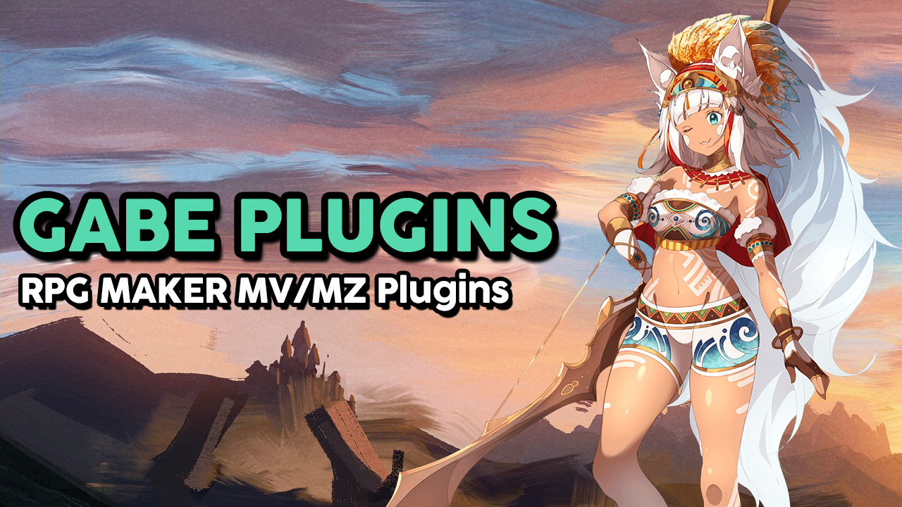

# Hi, everyone!

Hi everyone! I'm Gabriel, or just Gabe. 

I've already experienced RPG Maker for over ten years, I'm one of administrators of the brazilian RM forum [Centro RPG Maker](https://centrorpg.com/) and currently I'm dedicating to create **FREE** plugins for RPG Maker MZ. I'm in this initiative with the staff of the [Comuns RPG Maker](https://comuns-rpgmaker.github.io), a partnership with my great friends Brandt, Jorge, Reisen and Syureri.

All of my plugins are **100% FREE** and under the [Zlib License](https://github.com/comuns-rpgmaker/GabeMZ/blob/master/LICENSE). It's allowed to use them in both commercial and non-commercial games, I just ask you to read and respect the terms of the license to which my plugins are subject.

If you liked my work and want to support me, consider visiting my [Patreon](https://www.patreon.com/gabriel_nfd) or [Itch](https://dromarch.itch.io/) pages. If you have any questions, need help or want to report something about my plugins, feel free to join the [Comuns Plugins](https://discord.gg/GG85QRz) server on Discord.

I hope my work can be useful. :)

***

For the complete documentation of all my plugins check the list at the link below:
## [Gabe MZ - Plugins Documentation](Plugins)